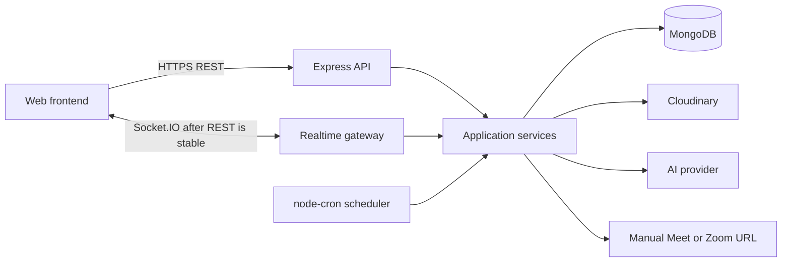

# SkillSwap Architecture and Implementation Roadmap

## Purpose

This document turns the finalized SkillSwap requirements and ER diagram into an implementation plan. It describes the intended system boundaries, the confirmed data model, critical business workflows, and a phased build order for the backend and frontend.

The safest implementation sequence is:

1. record the finalized Phase 0 decisions, API conventions, and deliberate deferrals;
2. build authentication and account permissions;
3. add skills, profiles, availability, and teacher discovery;
4. add connections and REST messaging;
5. implement booking and session state transitions;
6. implement credit reservation, completion, and admin resolution;
7. add reviews, reports, recurring sessions, and real-time delivery;
8. add AI features only after the underlying services are stable;
9. harden, observe, and deploy the complete system.

Do not build every module at once. Each phase below has dependencies and exit criteria so it can be completed and tested before the next phase begins.

## Requirements Baseline

When the supplied materials differ, use this order of authority:

1. confirmed corrections in the final project brief;
2. included and excluded decisions in the feature checklist;
3. the ER diagram as the baseline for collections, fields, and relationships.

The system is a peer-to-peer learning platform. Teaching earns credits and learning spends credits. It is not a direct skill-for-skill barter system.

### Confirmed technology choices

- Backend: Node.js, Express.js, MongoDB, and Mongoose.
- Authentication: JWT-based authentication.
- Uploads: Multer and Cloudinary where uploads are required.
- Initial communication: REST APIs.
- Later real-time communication: Socket.IO for chat and notifications.
- Scheduling: node-cron with a custom, database-backed scheduling service.
- Database authority: MongoDB is the source of truth.
- Product timezone: Asia/Kolkata.
- AI: an external AI service may support teacher discovery, learning guidance, and chat summaries.
- Not included initially: Redis, BullMQ, automatic meeting creation, built-in video calls, and email notifications.
- Current frontend status: backend-only development with API testing in Postman; frontend framework and build-tool selection are deferred until frontend development starts and do not block Phase 1.
- Environment/configuration: use `.env`, load it with `dotenv`, and access values directly through `process.env`; no centralized config-wrapper abstraction is required, and the database name may remain separately defined through the project's constants approach.
- Development and testing use the same database for now; do not introduce separate `.env.test` or test-database architecture at this stage.

## System Context



The REST controllers, Socket.IO handlers, cron jobs, and AI tools must all call the same application services. Business rules must not be duplicated in transport-specific code.

## Recommended Repository Shape

The exact filenames can evolve, but module boundaries should follow the business capabilities.

```text
SkillSwap Project/
├── docs/
│   └── architecture.md
├── backend/
│   ├── src/
│   │   ├── db/
│   │   │   └── index.js
│   │   ├── constants/
│   │   │   ├── enums.js
│   │   │   └── errorCodes.js
│   │   ├── models/
│   │   │   └── user.model.js
│   │   ├── modules/
│   │   │   ├── auth/
│   │   │   │   ├── auth.controller.js
│   │   │   │   ├── auth.routes.js
│   │   │   │   ├── auth.service.js
│   │   │   │   └── auth.validation.js
│   │   │   └── users/
│   │   │       ├── user.controller.js
│   │   │       ├── user.routes.js
│   │   │       ├── user.service.js
│   │   │       └── user.validation.js
│   │   ├── middlewares/
│   │   │   ├── accountType.middleware.js
│   │   │   ├── auth.middleware.js
│   │   │   ├── error.middleware.js
│   │   │   ├── notFound.middleware.js
│   │   │   └── role.middleware.js
│   │   ├── utils/
│   │   │   ├── ApiError.js
│   │   │   ├── ApiResponse.js
│   │   │   ├── asyncHandler.js
│   │   │   ├── cookieOptions.js
│   │   │   └── token.js
│   │   ├── app.js
│   │   ├── constants.js
│   │   └── index.js
│   ├── tests/
│   │   ├── unit/
│   │   │   ├── auth.validation.test.js
│   │   │   ├── token.test.js
│   │   │   └── user.model.test.js
│   │   ├── integration/
│   │   │   ├── currentUser.test.js
│   │   │   ├── login.test.js
│   │   │   ├── logout.test.js
│   │   │   ├── refresh.test.js
│   │   │   └── register.test.js
│   │   └── helpers/
│   │       ├── authHeader.js
│   │       ├── cleanupTestData.js
│   │       └── createTestUser.js
│   ├── .env
│   ├── .gitignore
│   ├── .prettierignore
│   ├── .prettierrc.json
│   ├── package-lock.json
│   └── package.json
└── frontend/
```

Within a backend module, use a consistent direction such as route -> controller -> service -> model/repository. Controllers should handle HTTP concerns; services should own authorization, state changes, transactions, and business rules.

## Core Architectural Rules

### Authorization and ownership

- `role` controls administrative authorization: `USER` or `ADMIN`.
- `accountType` controls product capabilities: `TEACHER`, `TEACHER_LEARNER`, or `LEARNER`.
- Use both JWT access and refresh tokens. Return the access token to the client, send it on protected requests as `Authorization: Bearer <accessToken>`, and do not store it as a server-managed authentication cookie.
- Store the raw refresh token only in an HttpOnly cookie, never return it in an API response body, and store only its hash in the database. Rotate it after a successful `/refresh`; successful rotation invalidates the old refresh token.
- Account-type permissions must be checked on the backend for every teaching or learning action.
- Never trust user IDs, ownership, reporting identities, prices, balances, or state supplied by the client without deriving or validating them against authenticated data.
- A user must have an `ACCEPTED` Match with the other participant before normal chat or session booking is allowed.

### Consistency and concurrency

- Use MongoDB transactions for multi-document balance changes and other related writes that must succeed or fail together.
- Make credit transfer, recurring generation, timeout processing, and deletion of an AI conversation idempotent.
- Back idempotency with database indexes or state predicates, not only in-memory checks.
- Use atomic conditional updates for state transitions. A transition should include the expected current status in its update filter.
- Keep cron jobs stateless. A restarted application must recover work from MongoDB without creating duplicate sessions or transfers.

### Time handling

- Treat Asia/Kolkata as the product scheduling timezone.
- Recommended implementation: persist actual instants as UTC dates and convert at API/UI boundaries; interpret weekly schedule values using Asia/Kolkata.
- Compare accepted session conflicts using calculated start and end instants, not formatted time strings.
- The API should return ISO 8601 timestamps and the frontend should clearly display the product timezone.

### Validation and error handling

- Use manual request-shape validation at the API boundary without Zod, Joi, express-validator, or another validation library. Registration request-shape and basic input validation belongs in `auth.validation.js`; database-dependent and business validation belongs in `auth.service.js`; Mongoose schema validation remains the persistence safety layer.
- Registration uses a strict request contract. Reject unknown fields rather than silently ignoring them, including client-supplied server-controlled or internal fields such as `role`, credits or balances, `rating`, `totalReviews`, `connections`, refresh-token data, or similar internal state.
- Apply these finalized registration field rules:
  - `fullname` is required, is trimmed, must be 2–60 characters long, and may contain normal letters, spaces, hyphens, and apostrophes.
  - `username` is required, must be 3–30 characters long, and may contain only lowercase letters, numbers, and underscores. Reject uppercase usernames; do not lowercase or otherwise silently modify them.
  - `email` is required, must have a valid email format, is trimmed, and is normalized to lowercase before storage or comparison.
  - `password` is required, must be at least 8 characters long, and must contain at least one uppercase letter, one lowercase letter, one number, and one special character. No maximum password length is currently defined.
  - `accountType` is required and must be `TEACHER`, `TEACHER_LEARNER`, or `LEARNER`.
  - `languages` is required for every account type and must be a non-empty array containing only finalized `LANGUAGES` enum values.
  - For `TEACHER` and `TEACHER_LEARNER`, `teachingSkills` and `teachingStyles` are required non-empty arrays. Every teaching Skill ID must have a valid MongoDB ObjectId shape, and every teaching style must be a finalized `TEACHING_STYLES` enum value. `auth.service.js` must query the predefined Skill catalog and confirm that every referenced Skill exists.
  - A `LEARNER` must not send `teachingSkills` or `teachingStyles`; reject the request if either field is supplied.
- Reject duplicate values in `languages`, `teachingStyles`, and `teachingSkills`; validation must not silently deduplicate client input.
- An avatar is optional during registration. If provided, it must use the Multer/Cloudinary file-upload flow; do not accept an arbitrary avatar URL or string in the registration body. File type, size, and other upload-specific validation belongs in upload middleware rather than `auth.validation.js`.
- Continue using the existing `ApiResponse` pattern for successful responses:

```json
{
  "statusCode": 200,
  "data": {},
  "message": "Some success message",
  "success": true
}
```

- Keep the existing project-style `ApiError` pattern, with user-safe messages and centrally defined constant error codes rather than arbitrary strings:

```json
{
  "statusCode": 400,
  "data": null,
  "message": "Some user-safe error message",
  "success": false,
  "errors": [],
  "code": "SOME_ERROR_CODE"
}
```

- Do not expose stack traces, password hashes, refresh tokens, provider secrets, or private AI prompts in API responses.
- Use `page` + `limit` for normal lists and search results, and cursor-based pagination for stream-like data such as chat messages. Exact response structures and endpoint-specific details are deferred until Phase 2 or the relevant later module; do not force every endpoint to use one method.
- Paginate every potentially unbounded list, including teachers, messages, notifications, reports, transactions, sessions, and AI messages.

## Confirmed Database Architecture

The architecture contains exactly 14 collections. Do not add another collection without a deliberate product decision.

| # | Logical collection | Responsibility |
|---:|---|---|
| 1 | User | Identity, role, account type, languages, teaching profile, rating, connection count, and balances |
| 2 | Skill | Predefined skill catalog organized by predefined categories |
| 3 | SkillRequest | User requests for missing skills to be considered for admin-approved catalog additions |
| 4 | Match | Connection request and relationship state between two users |
| 5 | Availability | A user's shared weekly availability for their permitted teaching and/or learning activities |
| 6 | Session | Regular and demo bookings, completion state, pricing, and recurring occurrences |
| 7 | CreditTransaction | Auditable credit movements |
| 8 | RecurringSchedule | Accepted recurring arrangement and occurrence template |
| 9 | Message | Normal user chat and explicitly shared AI summaries |
| 10 | AIConversation | A user's persistent AI conversation metadata |
| 11 | AIMessage | Individual user and assistant messages in an AI conversation |
| 12 | Review | Participant reviews for completed regular sessions |
| 13 | Report | User reports and admin moderation response |
| 14 | Notification | Website notifications and read state |

Choose and configure the physical MongoDB collection names explicitly before migrations. Do not allow accidental Mongoose pluralization to become an undocumented contract.

### Required corrections to the ER diagram

- `User.accountType` supports `TEACHER`, `TEACHER_LEARNER`, and `LEARNER`.
- `User.teachingStyles` is an array, allowing teachers to select multiple predefined enum values: `STEP_BY_STEP`, `HANDS_ON`, `CONCEPT_FOCUSED`, `PROJECT_BASED`, `INTERACTIVE`, `VISUAL`, and `NOT_SURE`.
- `User.languages` is an array of predefined enum values: `ENGLISH`, `HINDI`, `BENGALI`, `TELUGU`, `MARATHI`, `TAMIL`, `GUJARATI`, `KANNADA`, `MALAYALAM`, and `PUNJABI`. It belongs to the existing User collection; do not create a Language collection.
- `Skill.category` is a required predefined `SKILL_CATEGORIES` enum value. The categories remain hardcoded backend enum/constants; they are not seeded into MongoDB and do not create a Category collection.
- `Message.messageType` supports `TEXT` and `AI_SUMMARY`, defaulting to `TEXT`.
- `Session.sessionType` supports `REGULAR` and `DEMO`, defaulting to `REGULAR`.
- `RecurringSchedule.credits` stores the agreed credits per generated occurrence.
- A Session can have multiple Reviews, but only one per reviewer. Enforce a unique compound index on `{ session, reviewer }`.
- `CreditTransaction.session` may be null for an administrative or bonus transaction.

### Important collection relationships

- A User can offer many predefined Skills through `User.teachingSkills`. There is no `learningSkills` field, and category names are not duplicated on User.
- Each Skill belongs to one predefined category. Categories do not create a separate collection.
- Availability records belong to one User and form that user's single shared weekly schedule. A `TEACHER_LEARNER` uses the same schedule for both teaching and learning; do not add separate teaching/learning schedules or duplicate availability fields on User.
- A Match connects two users and is independent of skill.
- A Match can contain many Sessions.
- A Session references one Match, teacher, learner, and Skill; it may also reference one RecurringSchedule.
- A RecurringSchedule creates many separate Session documents.
- A Session can have at most two Reviews: one from each participant.
- A Message directly references its sender and receiver. It does not create a separate conversation collection.
- An AIConversation belongs to one User and contains many AIMessages.
- A Report may optionally reference a Session, a Message, or both when valid.

### Minimum index plan

Finalize enum values and query shapes before migration, then create indexes for at least:

- User: unique email and unique username; teaching skills, teaching styles, and languages for discovery.
- Skill: unique skill name using the selected case-sensitivity policy.
- SkillRequest: status and creation time; requestedBy and creation time.
- Match: sender/receiver/status queries in both participant directions.
- Availability: user and day.
- Session: participants plus scheduledAt; match plus createdAt; status plus scheduledAt; recurringSchedule plus scheduledAt; `{ teacher, skill, sessionType, status }` for completed regular-session counts.
- CreditTransaction: user plus createdAt; session; and a unique idempotency constraint matching the finalized debit/credit record design.
- RecurringSchedule: status plus date window; teacher; learner.
- Message: sender/receiver plus createdAt; receiver plus isRead.
- AIConversation: user plus updatedAt.
- AIMessage: conversation plus createdAt.
- Review: unique `{ session, reviewer }`; reviewedUser plus createdAt.
- Report: status plus createdAt; reportedUser plus createdAt.
- Notification: recipient plus isRead plus createdAt.

## Domain Workflows

### Account capabilities

| Account type | Can teach | Can learn |
|---|:---:|:---:|
| `TEACHER` | Yes | No |
| `TEACHER_LEARNER` | Yes | Yes |
| `LEARNER` | No | Yes |

A teaching-capable account must provide at least one teaching skill and at least one teaching style. A learner must not supply teaching fields during registration and may later upgrade to a teaching-capable account after supplying the required teaching information.

Every account type can manage one weekly availability schedule. A `LEARNER` uses it for learning, a `TEACHER` uses it for teaching, and a `TEACHER_LEARNER` uses the same schedule for both.

During registration and teaching-account upgrades, show the predefined categories and the predefined Skills within each category. Users select existing Skills from this catalog rather than creating or entering an arbitrary Skill directly. When SkillRequest functionality is implemented in Phase 2, a user may submit a request for a missing Skill.

### Teacher discovery

1. Validate that the requester can learn.
2. Load the requested predefined Skill.
3. Find users who can teach.
4. Require the requested Skill in `teachingSkills` as a strict filter.
5. If a teaching style was selected, require it in `teachingStyles` as a strict filter.
6. Require at least one common language: `teacher.languages ∩ learner.languages != empty`.
7. Apply the weighted compatibility calculation only to candidates who pass all applicable strict filters. Skill, selected teaching style, and common language are eligibility filters, not score bonuses.
8. Return eligible teachers from highest to lowest compatibility.

The finalized compatibility inputs are teacher rating, teacher `totalReviews`, availability match against the learner's preferred day/time, and the total number of `COMPLETED` `REGULAR` sessions taught by that teacher for the requested Skill. Derive the completed-session factor from the existing Session collection; do not add a denormalized counter to User or another collection. Exact weights and the exact formula are deliberately deferred until Phase 2, when discovery is implemented, and do not block Phase 1.

The AI assistant must call this same discovery service. It must not invent teachers or maintain a duplicate teacher database.

### Match lifecycle

The core Match states include pending, accepted, removed, rejected where supported by the finalized enum, and blocked.

- Only an accepted Match permits normal chat or booking.
- Removing a connection changes the existing Match to `REMOVED`; it does not delete history.
- Blocking records `blockedBy`. Only the original blocker can unblock.
- Removed or blocked chat history remains readable but becomes read-only.
- Reconnecting creates a new Match document.
- Both users' denormalized `connections` counts must change atomically with acceptance/removal when possible.

### Session booking

1. Confirm that the Match is accepted.
2. Confirm the teacher and learner are the Match participants.
3. Confirm their account types permit their assigned roles.
4. Confirm the teacher offers the selected Skill.
5. Validate the requested time against both participants' shared availability and the product timezone.
6. Allow overlapping `PENDING` requests.
7. On acceptance, check conflicts for both participants.
8. Reject conflicting pending requests after one request is accepted.
9. For a regular session, reserve the agreed credits in the same consistency boundary as acceptance.
10. For a demo session, require `credits = 0` and skip reservation.

Either participant can cancel an accepted session before its start. A regular-session cancellation releases its reservation and notifies the other participant.

### Session completion

Relevant statuses are `PENDING`, `ACCEPTED`, `REJECTED`, `CANCELLED`, `COMPLETION_PENDING`, `UNDER_REVIEW`, and `COMPLETED`.

| Scenario | Result |
|---|---|
| Teacher and learner confirm | Complete immediately and transfer regular-session credits |
| Teacher confirms; learner is silent for 24 hours | Complete through `LEARNER_TIMEOUT` if no dispute exists |
| Learner confirms; teacher is silent for 24 hours | Complete through `TEACHER_TIMEOUT` |
| Both are silent for the first 24 hours | Open the second 24-hour learner window |
| Both remain silent for 48 total hours | Move to `UNDER_REVIEW`; keep credits reserved |
| Learner disputes | Move immediately to `UNDER_REVIEW` |
| Admin approves completion | Complete with method `ADMIN` and transfer regular-session credits |
| Admin cancels | Cancel and release regular-session credits |

Only real user actions set `teacherConfirmedAt` or `learnerConfirmedAt`. Automated processing must not fabricate confirmation timestamps.

### Credit accounting

`spendableCredits = credits - reservedCredits`

- Reserve credits when a regular session becomes accepted.
- Never reserve or transfer credits for a demo session.
- Release a reservation when an applicable cancellation occurs.
- Keep the reservation during a dispute or admin review.
- On completion, debit the learner, credit the teacher, reduce the reservation, and write the audit records atomically.
- Exactly-once processing must be protected by Session state and a database uniqueness rule appropriate to the chosen transaction record shape.
- Never calculate an authoritative balance only by trusting a client value.

### Recurring sessions

- A RecurringSchedule is accepted once by the teacher.
- Each generated occurrence is a separate, automatically accepted Session.
- Each generated Session references its RecurringSchedule and Match and inherits the schedule's credits.
- Reserve credits separately for each generated regular occurrence.
- Generation must be idempotent and able to recover after downtime.
- The current provisional insufficient-credit behavior is to skip the occurrence, notify both participants, and keep the schedule active. Reconfirm the details before implementation.

### Messaging and AI summaries

- Normal chat starts only after Match acceptance.
- Begin with paginated REST messaging.
- `isDeleted` provides soft deletion while retaining data needed for moderation.
- A requested AI summary is initially private and is not persisted.
- Only an explicit share action creates a Message with `messageType = AI_SUMMARY`.
- Shared summaries must be visibly labeled in the UI.
- Socket.IO is a later delivery layer; MongoDB remains the message source of truth.

### AI assistant conversations

- Store multiple AIConversation records per user.
- Store each user and assistant turn as a separate AIMessage.
- Validate conversation ownership on every read, append, and delete.
- Deleting a conversation permanently deletes it and its AIMessages, preferably in a transaction.
- Require explicit user confirmation before the AI triggers an action such as sending a Match request.

### Reviews, reports, and notifications

- Only completed `REGULAR` sessions can be reviewed.
- Both participants may review each other, once each per Session.
- Demo sessions do not affect rating or total review count.
- Rating aggregates and Review creation must remain consistent under retries.
- The backend derives `reportedBy` and validates `reportedUser`, Session, and Message relationships.
- Session disputes and normal Reports are separate workflows.
- Notifications are website-only and support click-to-read through `isRead`.

## API Boundary Plan

Use a versioned prefix such as `/api/v1`. Final endpoint names can change, but the capability groups should remain stable.

| Capability | Initial REST responsibilities |
|---|---|
| Auth | register, login, refresh, logout, current user |
| Users | profile read/update, account upgrade, teaching profile |
| Skills | predefined catalog browse grouped by category; admin catalog management |
| Skill requests | create, list own; admin approve/reject |
| Discovery | teacher search by skill, optional teaching style, common language, pagination |
| Availability | manage own shared weekly slots; read teacher availability |
| Matches | request, accept/reject, remove, block/unblock, list |
| Sessions | request, accept/reject, cancel, list/detail, confirmations, dispute |
| Admin sessions | review queue, evidence workflow, final resolution |
| Credits | balance view and paginated transaction history |
| Recurring | propose, accept/reject, cancel, list/detail |
| Messages | conversation history, send, soft-delete, mark read, summarize/share |
| Reviews | create and list by user/session |
| Reports | create, list own; admin moderation |
| Notifications | list, unread count, mark read |
| AI | conversation CRUD, append message, teacher guidance/action confirmation |

Define an OpenAPI contract as each phase is implemented. The frontend should consume that contract through one API client layer rather than calling endpoints directly from page components.

## Phased Implementation Plan

### Phase 0 Project decisions and contracts

**Goal:** record the finalized decisions and deliberate deferrals needed to begin Phase 1 without blockers.

**Finalized Phase 0 decisions**

- Frontend development is currently deferred while the backend is built and tested with Postman; choose the frontend framework and build tool when frontend development starts.
- Teaching styles use the finalized multi-select enum values documented above.
- Compatibility scoring is weighted and uses the finalized inputs documented above; exact weights and the exact formula are deferred until Phase 2.
- JWT access-token and refresh-token transport, storage, hashing, and rotation follow the strategy documented above.
- Successful responses use `ApiResponse`; errors use `ApiError` with a stable central code; request validation is manual; pagination uses the mixed strategy documented above.
- Backend environment and testing use `.env`, `dotenv`, direct `process.env` access, and the same database for development and testing for now.

**Decide before the relevant later phase**

- Session price proposal/negotiation API and UI.
- Match duplicate-request policy and concurrency behavior without a `pairKey` field.
- CreditTransaction debit/credit audit-record shape and its exact-once unique index.
- Admin evidence metadata location because the current schema does not define evidence fields or a separate evidence collection.
- Recurring generation horizon and provisional insufficient-credit details.
- AI provider, model, limits, prompt/data-retention policy, and long-chat summarization strategy.

**Deliverables**

- An architecture decision record for each finalized choice.
- API conventions and environment-variable documentation.
- Initial endpoint and enum inventory.

**Exit criteria**

- No unresolved Phase 1 decision.
- Confirmed enums are documented in one backend source of truth.
- Frontend framework selection, exact compatibility weights/formula, and exact pagination response and endpoint details remain deliberate later-phase deferrals, not Phase 1 blockers.

### Phase 1 Backend foundation authentication and account permissions

**Goal:** establish the secure base used by every later module.

**Backend work**

- Initialize the Node/Express application, configuration validation, MongoDB connection, logging, and graceful shutdown.
- Add the User model, password hashing, registration, login, refresh, logout, and current-user endpoint.
- Add only the minimum Skill model and predefined-catalog functionality needed for registration and learner-to-teaching-account upgrades to reference existing Skill ObjectIds.
  - Maintain the initial predefined Skill data as backend-controlled seed data. Each seed entry contains only `name`, `category`, and `description`; MongoDB/Mongoose generates `_id`, `createdAt`, and `updatedAt`, and every `category` must be a predefined `SKILL_CATEGORIES` value.
  - Use a dedicated seed script to insert or upsert these documents into the existing Skill collection. Run it intentionally during database setup, not automatically on every application startup, and do not manually create the initial Skill documents one by one in MongoDB.
  - Once seeded, Skill documents remain persistent MongoDB data. The original seed file initializes the catalog but is not the permanent source of truth after runtime-created or admin-approved Skills exist; MongoDB remains the persistent source of truth.
- Add reusable authentication, role, account-type, validation, and error middleware.
- Enforce teaching fields for teaching-capable accounts and support learner-to-teacher account upgrades.
- Add unit and integration test foundations.

**Frontend work**

- Choose and initialize the frontend framework and build tool only when frontend development starts; this does not block Phase 1 backend work.
- Build the API client, auth state, protected routes, registration, login, and logout.
- Make account type and required teaching fields clear during registration.

**Exit criteria**

- Invalid or expired tokens are rejected consistently.
- USER/ADMIN and account-type checks are covered by tests.
- Passwords and refresh tokens are not exposed by APIs.
- Registration, login, refresh, logout, and account upgrade work end to end.

### Phase 2 Skills profiles availability and discovery

**Goal:** make real teacher profiles searchable without AI.

**Backend work**

- Complete the predefined categorized Skill catalog management and implement SkillRequest with admin approval/rejection; approved requests may create additional Skill documents beyond the original seeded catalog.
- Implement teaching-profile reads and updates using predefined Skill references.
- Implement Availability CRUD for all users using one shared weekly schedule per user.
- Implement teacher discovery with strict Skill, optional teaching-style, and common-language filtering before weighted compatibility scoring and ordering.
- Add pagination, safe public profile projection, and discovery indexes.

**Frontend work**

- Predefined Skill catalog grouped by category and skill-request UI.
- Teacher-profile editor and public teacher profile.
- Weekly availability editor.
- Teacher search with Skill and optional teaching-style filters, using the learner's languages for common-language eligibility.

**Exit criteria**

- Learner-only users cannot perform teaching-only mutations.
- Selecting a teaching style excludes teachers who do not have it.
- Teachers without a language in common with the learner are excluded before scoring.
- No style selection uses normal compatibility ordering.
- Discovery never exposes private User fields.

### Phase 3 Matches notifications and REST chat

**Goal:** establish user connections and durable communication before real-time features.

**Backend work**

- Implement Match request, acceptance/rejection, removal, block, and unblock transitions.
- Maintain connection counts safely.
- Implement Notification creation/list/read behavior for Match events.
- Implement paginated REST messages, read status, and soft deletion.
- Enforce read-only history for removed or blocked relationships.

**Frontend work**

- Connection request inbox/outbox and connection list.
- Block/remove confirmations and state-aware actions.
- Notification list and unread badge.
- REST-based chat screen with pagination and disabled composer when read-only.

**Exit criteria**

- Users cannot message without an accepted Match.
- Match transitions reject unauthorized and stale requests.
- Removal/blocking preserves readable history and prevents new messages.
- Reconnection creates a new Match.

### Phase 4 Session booking demos and cancellation

**Goal:** implement booking without completion automation or credit transfer complexity.

**Backend work**

- Implement Session request/list/detail using Match, participant, account-type, Skill, and availability validation.
- Support `REGULAR` and `DEMO` in the same workflow.
- Allow overlapping pending requests.
- On acceptance, detect conflicts for both participants and reject conflicting pending requests.
- Store manually supplied Meet/Zoom links.
- Implement pre-start cancellation by either participant.
- Integrate reservation hooks for regular sessions once the agreed price is final.

**Frontend work**

- One booking form with regular/demo selection.
- Duration, time, skill, agreed-price, and meeting-link interactions.
- Teacher pending-request queue and accept/reject actions.
- Upcoming/past session views and cancellation.

**Exit criteria**

- Demo sessions always have zero credits and no reservation.
- Accepted sessions cannot overlap another accepted session for either participant.
- Both participants can cancel before the scheduled start.
- Every state-changing endpoint is ownership- and state-checked.

### Phase 5 Credits completion and admin session resolution

**Goal:** make the financially sensitive session lifecycle correct and retry-safe.

**Backend work**

- Implement reservation and release using `credits` and `reservedCredits`.
- Implement teacher/learner confirmations, learner disputes, and the six completion scenarios.
- Implement node-cron checks for sequential 24-hour windows.
- Implement atomic, exactly-once completion transfer and CreditTransaction records.
- Implement the admin `UNDER_REVIEW` queue, evidence request/deadline behavior after its schema decision, and final complete/cancel actions.
- Generate Notifications for completion, dispute, evidence, cancellation, and admin decisions.

**Frontend work**

- Show total, reserved, and spendable credits clearly.
- Confirmation/dispute UI with current status and deadlines.
- Credit transaction history.
- Admin session-review queue and resolution workflow.

**Exit criteria**

- Concurrent or repeated completion requests cannot double-transfer credits.
- Cancellation and admin cancellation release exactly the correct reservation.
- Under-review sessions keep credits reserved.
- Automated completion does not create false user confirmation timestamps.
- Restarting cron processing produces no duplicate side effects.

### Phase 6 Reviews reports and moderation

**Goal:** complete trust, reputation, and ordinary moderation workflows.

**Backend work**

- Allow reviews only for completed regular sessions and their participants.
- Enforce `{ session, reviewer }` uniqueness.
- Maintain rating and totalReviews safely.
- Implement Report creation with derived identities and validated optional references.
- Implement admin report queue, status, and response.

**Frontend work**

- Review forms and rating displays.
- Report-user flow with optional valid Session/Message context.
- Admin moderation queue and response UI.

**Exit criteria**

- No demo review is possible.
- Each participant can review the other at most once per regular Session.
- Arbitrary users, messages, or sessions cannot be attached to a Report.
- Session dispute resolution remains separate from Reports.

### Phase 7 Recurring sessions

**Goal:** generate reliable recurring occurrences using MongoDB as the source of truth.

**Backend work**

- Finalize the generation window and insufficient-credit behavior.
- Implement recurring proposal, one-time teacher acceptance, cancellation, and listing.
- Implement rolling occurrence generation with a deterministic duplicate-prevention rule.
- Create automatically accepted Session documents and reserve each occurrence separately.
- Recover missed generation after downtime.

**Frontend work**

- Recurring proposal form and schedule summary.
- Teacher acceptance/rejection.
- Recurring schedule management and generated-occurrence visibility.
- Clear skipped-occurrence notification when credits are insufficient.

**Exit criteria**

- Running the generator repeatedly creates no duplicate occurrence.
- Restarting after downtime fills the intended window without duplicates.
- One insufficient occurrence does not silently create an unfunded accepted Session.
- Manual sessions have no recurringSchedule reference.

### Phase 8 Socket.IO real-time delivery

**Goal:** improve responsiveness without changing business authority.

**Backend work**

- Authenticate the Socket.IO handshake.
- Authorize rooms using the same Match/user rules as REST.
- Emit message and notification events only after database writes succeed.
- Add reconnect and missed-event recovery through REST queries.

**Frontend work**

- Add live messages, read indicators, and notifications.
- Reconcile socket events with cached REST data without duplicates.
- Fall back to REST when the socket is unavailable.

**Exit criteria**

- Socket disconnection never causes permanent data loss.
- Unauthorized users cannot join another user's room.
- Duplicate delivery does not create duplicate UI records.

### Phase 9 AI summaries and assistant

**Goal:** add AI as an orchestrator over stable, authorized application services.

**Backend work**

- Finalize provider, limits, privacy, retention, and prompt-injection defenses.
- Implement private, on-demand chat summarization without persistence.
- Implement explicit share-to-Message using `AI_SUMMARY`.
- Implement AIConversation and AIMessage ownership-safe CRUD.
- Let the assistant translate user intent into parameters for the real discovery service.
- Require confirmation before any Match or other state-changing action.

**Frontend work**

- Private summary preview and explicit Share action.
- Multiple AI conversation list, history, continuation, and hard delete.
- Clearly distinguish AI content and confirmation-required actions.

**Exit criteria**

- Unshared summaries are not stored.
- The AI returns only real teachers obtained from backend discovery.
- AI cannot bypass authorization or account-type rules.
- Deleting a conversation removes its messages and validates ownership.

### Phase 10 Hardening release and operations

**Goal:** prepare the complete application for dependable use.

**Work**

- Add rate limits for auth, chat, uploads, reports, and AI endpoints.
- Add security headers, strict CORS, payload limits, upload type/size checks, and secret management.
- Add structured logs, request IDs, audit events for sensitive admin/credit actions, health checks, and alerts.
- Add database backup/restore procedures and migration/index deployment steps.
- Run unit, integration, transaction/concurrency, cron recovery, Socket.IO, authorization, and end-to-end tests.
- Test accessibility, responsive behavior, loading states, empty states, and error recovery in the frontend.
- Create staging and production configurations with separate databases and media credentials.

**Exit criteria**

- Critical workflows pass automated end-to-end tests.
- Backup restoration has been tested.
- Logs can trace a session booking through reservation and final transfer.
- No high-severity authorization, concurrency, or secret-handling issue remains.

## Testing Strategy

Use a test pyramid throughout the phases rather than postponing testing.

- **Unit tests:** compatibility calculation, account capabilities, time/conflict calculation, allowed state transitions, spendable balance, and deadline calculation.
- **Service integration tests:** Match transitions, Session acceptance, cancellation, credit reservation/transfer, recurring generation, reviews, reports, and AI ownership.
- **Concurrency tests:** simultaneous Match acceptance, Session acceptance, cancellation versus completion, repeated cron runs, and repeated transfer attempts.
- **API tests:** authentication, validation, authorization, pagination, response shape, and safe field projection.
- **End-to-end tests:** register -> discover -> connect -> chat -> book -> complete -> review, including admin-review and recurring variants.

Each phase should add tests for both allowed behavior and attempts by the wrong user, wrong account type, wrong role, or wrong state.

## Known Decision Gates and Risks

Resolve these explicitly; do not hide them in implementation details.

1. **Match pair uniqueness:** `pairKey` is rejected, but concurrent reverse-direction requests are difficult to prevent with a simple unique index. Define the exact duplicate-request policy and consistency mechanism before Phase 3.
2. **Credit ledger shape:** exactly-once transfer needs a unique database guard. Finalize whether CreditTransaction stores one signed row per user or another approved representation before Phase 5.
3. **Admin evidence storage:** evidence photos and individual deadlines are required, while a separate evidence collection and unapproved Session fields are excluded. Decide where approved metadata is stored before building that workflow.
4. **Message history across reconnection:** Message has sender/receiver but no Match reference. Confirm whether a reconnected pair sees one continuous history or histories must be separated.
5. **Recurring insufficient credits:** the skip-and-notify rule is provisional and must be reconfirmed in Phase 7.
6. **Compatibility weights and formula:** the inputs are finalized, while exact weights and the exact formula are deliberately deferred until Phase 2 and do not block Phase 1.
7. **AI privacy and cost:** provider, data retention, input limits, rate limits, and consent for long-chat summaries must be decided before Phase 9.

## Immediate Next Steps

Phase 0 has no unresolved decisions blocking Phase 1. The next concrete work items are:

1. Initialize the backend with the finalized environment approach, configuration validation, MongoDB connection, error handling, and tests.
2. Implement the User schema, including the finalized teaching-style and language enums, before creating the other 13 models.
3. Implement authentication with the finalized access-token and rotating refresh-token strategy.
4. Apply the finalized response, error, manual-validation, and mixed-pagination conventions as their endpoints are implemented.

Do not begin booking, credits, cron jobs, Socket.IO, or AI until their prerequisite phases and exit criteria are complete.
